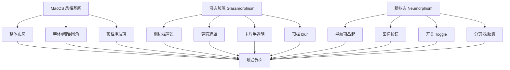

# OneFive 前端重构计划

> 目标：以 **MacOS 风格 + 液态玻璃（Glassmorphism）+ 新拟态（Neumorphism）** 重构整个前端，删除 Home 页，启用项目图标 `onefive.png`，支持明暗双主题切换。

---

## 一、当前状态分析

### 1.1 项目栈
- Vue 3.4 + TypeScript + Vite 5 + Pinia + Vue Router 4
- Element Plus 2.6（全量引入，实际使用率极低）
- 原生 CSS，无预处理器

### 1.2 核心问题
| 问题 | 现状 | 影响 |
|------|------|------|
| 样式系统碎片化 | 三套变量并存：`App.vue` 全局 + `Layout.vue` 局部 + 各页面硬编码 | 主题色不统一，无法统一切换 |
| 命名不统一 | `--accent` vs `--accent-color`、`--border` vs `--border-color`、`--radius` vs `--radius-md` | 维护困难 |
| 大量硬编码颜色 | Home.vue/Files.vue/Settings.vue/Login.vue 内到处是 `#3b82f6`、`#1d1d1f` 等 | 改主题需逐处修改 |
| Logo 未使用项目图标 | 侧边栏/关于页都是内联 SVG "15" 渐变图标 | 项目品牌未落地 |
| 无主题切换 | 仅亮色，LogViewer 是独立暗色 | 用户无法切换 |
| 遗留文件 | `style.css`、`HelloWorld.vue`、`Organize.vue` 未引用 | 文件冗余 |
| Element Plus 全量引入 | 实际只覆盖少量组件样式 | 打包体积大 |

### 1.3 现有文件清单
```
frontend/src/
├── api/           # auth/files/index/logs/notification/organize （保留，不动）
├── components/    # Toast/LogViewer/RecognizeModal + HelloWorld(删)
├── composables/   # useToast
├── router/        # index.ts（改：删 Home，根路径重定向 /files）
├── stores/        # auth.ts
├── views/         # Layout/Login/Files/Settings/About + Home(删) + Organize(删)
├── App.vue
├── main.ts
└── style.css      # (删)
```

### 1.4 用户决策
1. 删除 Home 后根路径 `/` → **重定向到 `/files`**
2. **支持暗色/亮色切换**
3. **全部页面完整重写**（含 Files/Settings 内部表单）

---

## 二、设计系统总览

### 2.1 三种风格融合策略



- **MacOS 风格**：作为基底（SF 字体、大圆角 12-20px、柔和阴影、精致间距 8/12/16/24）
- **液态玻璃**：用在容器层（侧边栏、顶栏、弹窗、Toast）—— `backdrop-filter: blur(20px) saturate(180%)` + 半透明背景
- **新拟态**：用在交互元素（导航项、图标按钮、开关、分页器、胶囊开关）—— 双向柔和阴影制造凸起感

### 2.2 色彩系统（明/暗双主题）

| Token | 亮色 | 暗色 | 用途 |
|-------|------|------|------|
| `--bg-base` | `#f5f5f7` | `#1a1a1c` | 页面底色 |
| `--bg-elevated` | `rgba(255,255,255,0.72)` | `rgba(44,44,46,0.72)` | 玻璃容器 |
| `--bg-solid` | `#ffffff` | `#2c2c2e` | 不透明卡片/弹窗 |
| `--bg-hover` | `rgba(0,0,0,0.04)` | `rgba(255,255,255,0.06)` | hover 态 |
| `--bg-selected` | `rgba(0,113,227,0.08)` | `rgba(10,132,255,0.16)` | 选中态 |
| `--text-primary` | `#1d1d1f` | `#f5f5f7` | 主文字 |
| `--text-secondary` | `#6e6e73` | `#aeaeb2` | 次文字 |
| `--text-tertiary` | `#aeaeb2` | `#6e6e73` | 三级文字 |
| `--accent` | `#0071e3` | `#0a84ff` | 主色（蓝） |
| `--accent-hover` | `#0077ed` | `#409cff` | 主色 hover |
| `--success` | `#34c759` | `#30d158` | 成功 |
| `--warning` | `#ff9500` | `#ff9f0a` | 警告 |
| `--danger` | `#ff3b30` | `#ff453a` | 危险 |
| `--purple` | `#af52de` | `#bf5af2` | 次强调（保留原 Settings 紫色调） |
| `--border` | `rgba(0,0,0,0.08)` | `rgba(255,255,255,0.1)` | 边框 |
| `--border-strong` | `rgba(0,0,0,0.12)` | `rgba(255,255,255,0.16)` | 强边框 |

### 2.3 阴影系统

```css
/* 液态玻璃 */
--glass-blur: blur(20px) saturate(180%);
--glass-border: 1px solid rgba(255,255,255,0.18); /* 亮色高光 */
--glass-shadow: 0 8px 32px rgba(0,0,0,0.12);

/* 新拟态凸起（亮色） */
--neu-raised-light: 
  -6px -6px 12px rgba(255,255,255,0.9),
  6px 6px 12px rgba(0,0,0,0.06);
/* 新拟态凸起（暗色） */
--neu-raised-dark: 
  -6px -6px 12px rgba(60,60,64,0.12),
  6px 6px 12px rgba(0,0,0,0.5);
/* 新拟态凹陷 */
--neu-inset-light:
  inset -3px -3px 6px rgba(255,255,255,0.9),
  inset 3px 3px 6px rgba(0,0,0,0.06);

/* 常规柔和阴影 */
--shadow-sm: 0 1px 3px rgba(0,0,0,0.06);
--shadow-md: 0 4px 16px rgba(0,0,0,0.08);
--shadow-lg: 0 12px 40px rgba(0,0,0,0.12);
```

### 2.4 圆角

```css
--radius-sm: 8px;   /* 小按钮、标签 */
--radius-md: 12px;  /* 卡片、输入框 */
--radius-lg: 16px;  /* 弹窗、大卡片 */
--radius-xl: 20px;  /* 玻璃容器 */
--radius-full: 9999px; /* 圆形 */
```

---

## 三、实施步骤

### Phase 0：资源准备与清理

#### 0.1 引入项目图标
- 复制 `d:\OneFive\onefive.png` → `frontend/src/assets/logo.png`
- 复制 `d:\OneFive\onefive.png` → `frontend/public/favicon.png`（替换 favicon.svg）
- 同步更新 `frontend/index.html` 的 `<link rel="icon">` 指向 `/favicon.png`

#### 0.2 删除遗留文件
- `frontend/src/style.css`（未被 import）
- `frontend/src/components/HelloWorld.vue`（未被引用）
- `frontend/src/views/Organize.vue`（孤儿文件，无 import）
- `frontend/src/views/Home.vue`（用户要求删除）
- `frontend/src/assets/vue.svg`、`vite.svg`、`hero.png`（不再使用）

#### 0.3 目录结构重组
新建 `frontend/src/styles/` 目录：
```
frontend/src/styles/
├── tokens.css        # 设计变量（明暗双主题）
├── base.css          # 全局 reset + body + 滚动条 + Element Plus 覆盖
├── glass.css         # 液态玻璃 utility 类（.glass-panel/.glass-card）
└── neu.css           # 新拟态 utility 类（.neu-raised/.neu-inset/.neu-flat）
```

新建 `frontend/src/composables/useTheme.ts`：主题切换逻辑

新建 `frontend/src/stores/theme.ts`：Pinia 主题 store

---

### Phase 1：设计系统基建

#### 1.1 `frontend/src/styles/tokens.css`
定义 `:root`（亮色默认）和 `:root[data-theme="dark"]`（暗色）两套 CSS 变量，涵盖：
- 背景层（base/elevated/solid/hover/selected）
- 文字层（primary/secondary/tertiary）
- 语义色（accent/success/warning/danger/purple）
- 边框（border/border-strong）
- 阴影（glass-blur/neu-raised/neu-inset/shadow-sm/md/lg）
- 圆角（sm/md/lg/xl/full）
- 过渡（transition-fast/base/slow）

#### 1.2 `frontend/src/styles/base.css`
- `* { margin:0; padding:0; box-sizing:border-box; }`
- `body` 字体（SF Pro / PingFang SC）、背景 `var(--bg-base)`、颜色 `var(--text-primary)`、`font-feature-settings: "ss01"`
- 自定义滚动条（明暗双色）
- `html,body,#app { height:100%; overflow:hidden; }`
- Element Plus 组件覆盖：`.el-button--primary`、`.el-card`、`.el-dialog`、`.el-input__wrapper`、`.el-select` 全部绑定到新 token

#### 1.3 `frontend/src/styles/glass.css`
```css
.glass-panel {
  background: var(--bg-elevated);
  backdrop-filter: var(--glass-blur);
  -webkit-backdrop-filter: var(--glass-blur);
  border: 1px solid var(--border);
  box-shadow: var(--glass-shadow);
}
.glass-card { /* 同上但更轻量 */ }
.glass-overlay { /* 弹窗遮罩用 */ background: rgba(0,0,0,0.3); backdrop-filter: blur(8px); }
```

#### 1.4 `frontend/src/styles/neu.css`
```css
.neu-raised {
  background: var(--bg-base);
  box-shadow: var(--neu-raised);
  border: none;
}
.neu-raised:hover { box-shadow: var(--neu-raised-strong); transform: translateY(-1px); }
.neu-inset { box-shadow: var(--neu-inset); }
.neu-flat { box-shadow: var(--shadow-sm); }
```

#### 1.5 `frontend/src/composables/useTheme.ts`
```ts
type Theme = 'light' | 'dark'
export function useTheme() {
  const theme = ref<Theme>(getStored())
  function toggle() { setTheme(theme.value === 'light' ? 'dark' : 'light') }
  function setTheme(t: Theme) {
    theme.value = t
    document.documentElement.setAttribute('data-theme', t)
    localStorage.setItem('onefive-theme', t)
  }
  function getStored(): Theme {
    const saved = localStorage.getItem('onefive-theme')
    if (saved === 'light' || saved === 'dark') return saved
    return window.matchMedia('(prefers-color-scheme: dark)').matches ? 'dark' : 'light'
  }
  // 初始化
  onMounted(() => setTheme(theme.value))
  return { theme, toggle, setTheme }
}
```

#### 1.6 `frontend/src/main.ts`
```ts
import './styles/tokens.css'
import './styles/base.css'
import './styles/glass.css'
import './styles/neu.css'
// 其余保持，但移除 App.vue 内的全局样式
```

---

### Phase 2：路由与入口调整

#### 2.1 `frontend/src/router/index.ts`
- 删除 Home 子路由
- 根路径 `/` 的子路由改为 `redirect: '/files'`

```ts
{
  path: '/',
  name: 'Layout',
  component: () => import('@/views/Layout.vue'),
  meta: { requiresAuth: true },
  redirect: '/files',   // 新增：根路径直接重定向
  children: [
    { path: 'files', name: 'Files', component: () => import('@/views/Files.vue') },
    { path: 'settings', name: 'Settings', component: () => import('@/views/Settings.vue') },
    { path: 'about', name: 'About', component: () => import('@/views/About.vue') },
  ]
}
```

#### 2.2 `frontend/src/App.vue`
- 移除 `<style>` 中的全局变量与 reset（已迁移到 styles/）
- 保留 `<template>` 结构（router-view + Toast）
- 在 `<script setup>` 中调用 `useTheme()` 初始化主题
- 顶层加 `<div :data-theme="theme">` 便于调试（可选）

---

### Phase 3：布局组件重写 `Layout.vue`

#### 3.1 结构调整
- **移除**：内联 SVG "15" Logo
- **新增**：`` 项目图标
- **新增**：顶栏右侧主题切换按钮（太阳/月亮图标）
- **移除**：`currentTitle` 中的 `'Home'` 映射
- **移除**：侧边栏中的"首页"导航项
- 导航项变为：文件管理 / 设置 / 关于

#### 3.2 视觉重构
- **侧边栏**：液态玻璃风格
  - `background: var(--bg-elevated)`
  - `backdrop-filter: var(--glass-blur)`
  - Logo 区高度 64px，logo 尺寸 40×40，品牌名 SF Pro 18px 700
- **导航项**：新拟态凸起（默认平，hover 凸起，active 凹陷+主色填充）
  - 默认：`background: transparent`
  - hover：`box-shadow: var(--neu-raised)` + `transform: translateY(-1px)`
  - active：`background: var(--accent)` + `color: #fff` + `box-shadow: var(--neu-inset)`
- **用户卡片**：液态玻璃 + 新拟态头像
- **顶栏**：液态玻璃 `backdrop-filter: blur(20px)`，固定在顶部
  - 左：页面标题
  - 右：主题切换按钮 + 日志按钮
- **退出确认弹窗**：液态玻璃 + 居中卡片
- **响应式**：≤768px 侧边栏变抽屉，遮罩用 `.glass-overlay`

#### 3.3 样式实现
- 删除原 `<style scoped>` 中的局部变量定义（已统一到 tokens.css）
- 所有颜色引用 `var(--xxx)`
- 保留所有功能逻辑不变

---

### Phase 4：登录页重写 `Login.vue`

#### 4.1 视觉重构
- **背景**：渐变 + 模糊光斑（`radial-gradient` 多层叠加）作为登录页底
- **登录卡片**：液态玻璃
  - `background: var(--bg-elevated)`
  - `backdrop-filter: var(--glass-blur)`
  - `border: 1px solid var(--glass-border)`
  - `box-shadow: var(--glass-shadow)`
- **Logo 区**：使用 `` 80×80，居中
- **二维码框**：新拟态凹陷 `box-shadow: var(--neu-inset)`
- **按钮**：主按钮新拟态凸起 + 主色填充；次按钮玻璃质感
- **设备选择网格**：每个设备项新拟态凸起，active 主色填充
- **Cookies 输入弹窗**：液态玻璃遮罩 + 居中卡片

#### 4.2 逻辑保持
所有登录逻辑（二维码获取、轮询、Cookies 登录、设备切换）保持不变，只换样式与 token。

---

### Phase 5：文件管理页重写 `Files.vue`

#### 5.1 视觉重构
- **面包屑栏**：液态玻璃卡片
- **工具栏**：液态玻璃卡片 + 新拟态按钮
  - 普通按钮：`.neu-flat`（轻阴影）
  - hover：`.neu-raised`（凸起）
  - danger 按钮：`color: var(--danger)` + hover 红色背景
- **搜索框**：新拟态凹陷 `.neu-inset`
- **文件列表容器**：液态玻璃卡片
- **表头**：`background: var(--bg-hover)` + `backdrop-filter: blur(8px)` 粘性吸顶
- **文件行**：
  - 默认：透明
  - hover：`background: var(--bg-hover)`
  - selected：`background: var(--bg-selected)` + 左侧 3px 主色条
- **复选框**：新拟态风格
- **文件图标**：文件夹 `var(--warning)`，文件 `var(--text-tertiary)`
- **更多按钮**：新拟态圆形按钮
- **右键菜单**：液态玻璃 + 阴影
- **弹窗（移动/复制/新建/重命名/删除）**：液态玻璃遮罩 + 居中卡片
- **目录选择器**：同弹窗风格
- **分页器**：新拟态按钮，active 主色填充

#### 5.2 逻辑保持
所有文件操作逻辑保持不变。

---

### Phase 6：设置页重写 `Settings.vue`

#### 6.1 视觉重构
- **主卡片**：液态玻璃 `.glass-panel`
- **卡片头部**：图标区新拟态凸起圆形（每个图标保留原配色 token）
- **折叠箭头**：新拟态风格
- **字段输入框**：新拟态凹陷
  - `background: var(--bg-base)`
  - `box-shadow: var(--neu-inset)`
  - focus 时 `box-shadow: var(--neu-inset), 0 0 0 3px var(--accent-bg)`
- **开关 Toggle**：新拟态轨道 + 凸起圆点
- **胶囊开关（移动/复制）**：新拟态容器 + 滑块
- **子卡片（通知渠道）**：嵌套液态玻璃
- **标签输入**：新拟态凹陷容器
- **按钮**：
  - 主按钮（保存）：主色填充 + 新拟态凸起
  - 次按钮（测试/取消）：玻璃质感
- **目录选择器弹窗**：液态玻璃 + 新拟态列表项
- **所有颜色硬编码替换为 token**

#### 6.2 逻辑保持
所有设置加载/保存/通知登录逻辑保持不变。

---

### Phase 7：关于页重写 `About.vue`

- Logo 区使用 `` 56×56
- 卡片：液态玻璃
- 信息行：hover 时 `var(--bg-hover)`
- 技术栈标签：新拟态凸起小标签
- 所有颜色 token 化

---

### Phase 8：通用组件重写

#### 8.1 `Toast.vue`
- 容器：液态玻璃 + 圆角
- `background: var(--bg-solid)` + `backdrop-filter: var(--glass-blur)`
- 图标颜色用 token：success/error/info

#### 8.2 `LogViewer.vue`
- 抽屉面板：液态玻璃
- 移除原独立暗色主题，改为跟随全局主题
- 暗色模式下日志文本颜色自动适配
- 筛选输入框：新拟态凹陷

#### 8.3 `RecognizeModal.vue`
- 弹窗：液态玻璃遮罩 + 居中卡片
- 海报区：新拟态凹陷边框
- 信息行：hover 高亮
- 执行按钮：主色新拟态凸起

---

### Phase 9：主题切换按钮组件

新建 `frontend/src/components/ThemeToggle.vue`：
- 太阳/月亮图标切换
- 新拟态圆形按钮
- 点击调用 `useTheme().toggle()`
- 在 Layout 顶栏右侧、Login 页右上角各放一个

---

## 四、Assumptions & Decisions

### 4.1 假设
1. `onefive.png` 是合适尺寸的 PNG（建议 512×512 或更大），可直接用于各场景
2. Element Plus 保留全量引入（不在本次重构范围内做按需优化，避免引入额外风险）
3. 用户浏览器支持 `backdrop-filter`（现代浏览器均支持，Safari/Chrome/Edge/Firefox 103+）
4. 主题持久化使用 `localStorage`（key: `onefive-theme`）

### 4.2 决策
1. **不引入 Tailwind/Sass**：保持原生 CSS + CSS 变量，降低依赖
2. **不引入暗色模式库**：手写 `data-theme` 属性切换，零依赖
3. **保留 Element Plus**：但全局覆盖其样式绑定到新 token
4. **主题切换不放 Pinia**：直接 composable + localStorage，避免过度工程化
5. **`onefive.png` 复制到 `src/assets/`**：通过 Vite 的 asset 处理，享受哈希指纹和构建优化；同时复制一份到 `public/` 作为 favicon
6. **新拟态仅用于交互元素**：避免大面积使用导致视觉疲劳
7. **液态玻璃用于容器层**：侧边栏、顶栏、弹窗、卡片
8. **删除 Home 后不保留根路径空白页**：直接 redirect 到 `/files`

---

## 五、验证步骤

### 5.1 开发阶段验证
```bash
cd d:\OneFive\frontend
npm run dev
```
逐页验证：
1. 访问 `/` 自动跳转 `/files`，侧边栏"首页"已消失
2. 侧边栏 Logo 是项目图标 `onefive.png`，非 SVG "15"
3. 顶栏右侧主题切换按钮可用，点击切换明暗
4. 刷新页面主题保持（localStorage 持久化）
5. 跟随系统暗色模式（首次访问未设置过主题时）
6. 各页面在明暗模式下颜色正确：
   - 文字可读性
   - 边框可见
   - hover/active 态清晰
   - 弹窗遮罩模糊生效
7. 液态玻璃效果生效（侧边栏背景模糊可见背后内容）
8. 新拟态按钮有凸起感
9. 所有交互（文件管理/设置保存/通知登录/二维码登录）功能正常

### 5.2 构建验证
```bash
npm run build
```
- TypeScript 编译无错误
- Vite 构建成功
- 打包产物 `dist/` 生成
- 产物体积与重构前对比（应略有增加因新增样式文件，但不应爆炸增长）

### 5.3 清理验证
- `frontend/src/views/Home.vue` 不存在
- `frontend/src/views/Organize.vue` 不存在
- `frontend/src/components/HelloWorld.vue` 不存在
- `frontend/src/style.css` 不存在
- 代码中无 `import Home` / `import Organize` 残留
- 代码中无 `#3b82f6`、`#1d1d1f`、`#6e6e73`、`#e8e8ed` 等硬编码颜色（应全部 token 化）

---

## 六、执行顺序（Todo 跟踪）

1. **Phase 0**：资源准备（复制 logo、删除遗留文件、建 styles 目录）
2. **Phase 1**：设计系统基建（tokens/base/glass/neu + useTheme）
3. **Phase 2**：路由与入口调整（router redirect、main.ts、App.vue）
4. **Phase 3**：Layout.vue 重写（含 ThemeToggle 组件）
5. **Phase 4**：Login.vue 重写
6. **Phase 5**：Files.vue 重写
7. **Phase 6**：Settings.vue 重写
8. **Phase 7**：About.vue 重写
9. **Phase 8**：Toast/LogViewer/RecognizeModal 重写
10. **验证**：dev 启动 + 构建检查 + 逐页核查
